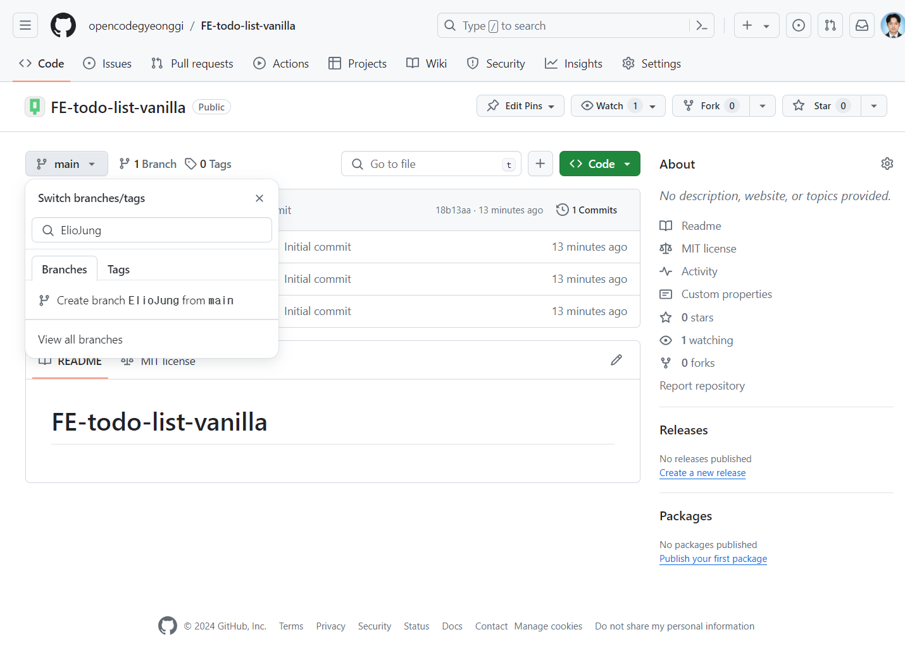
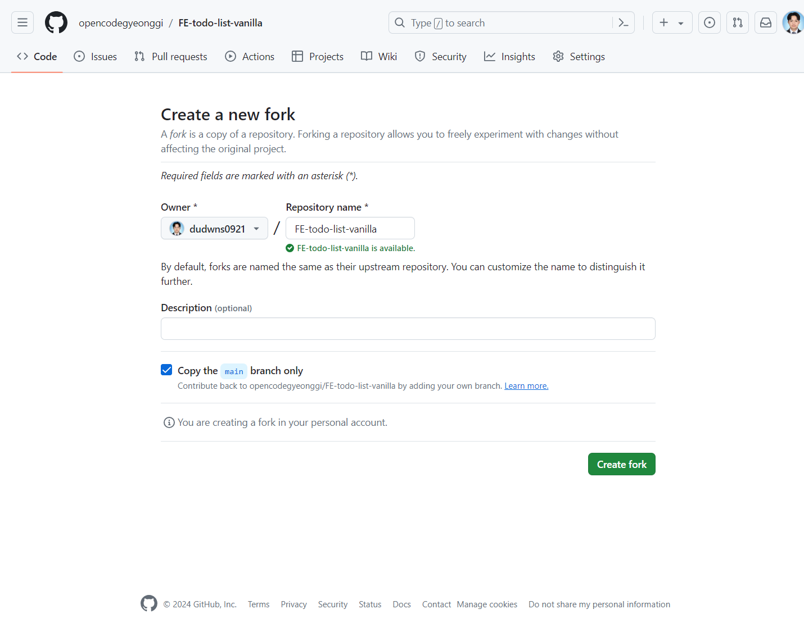
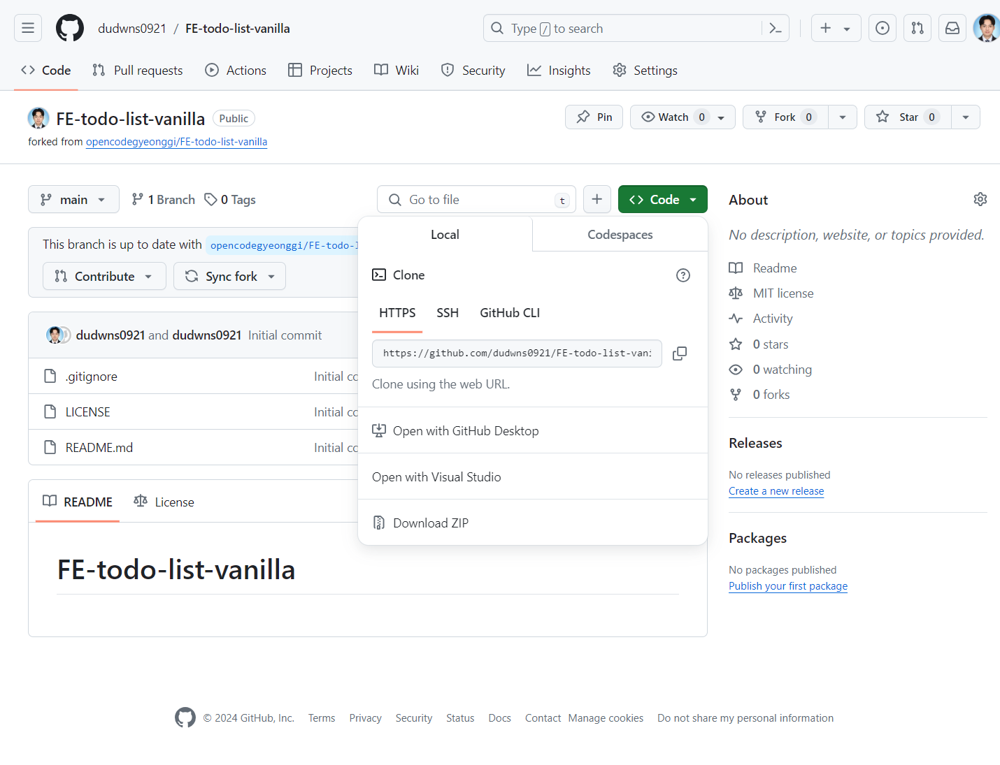
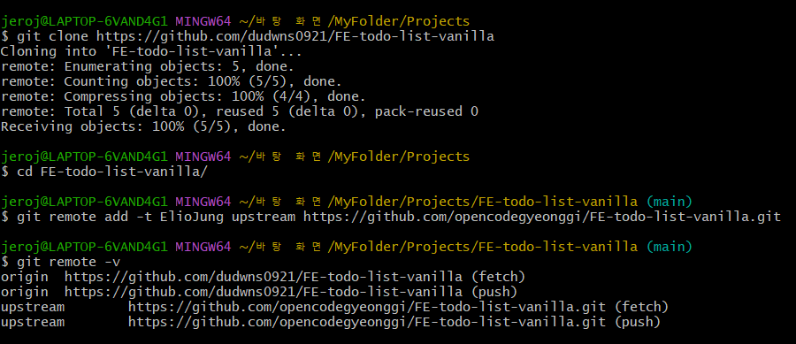
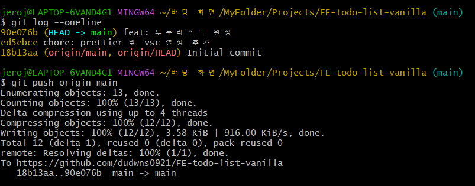
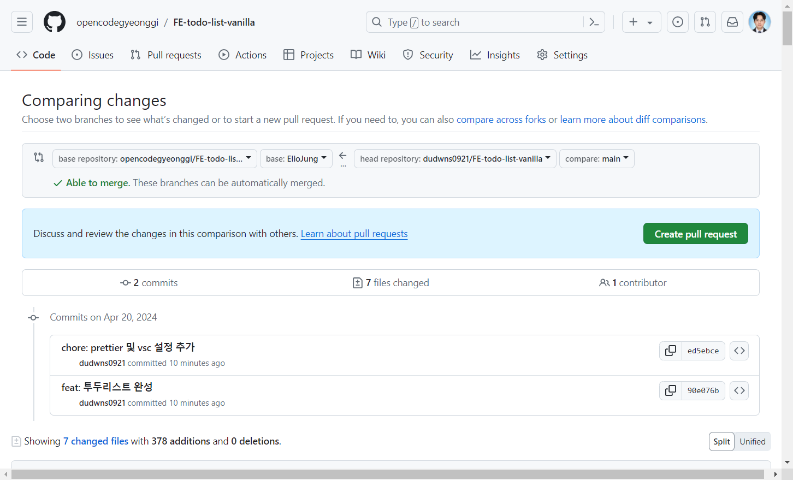
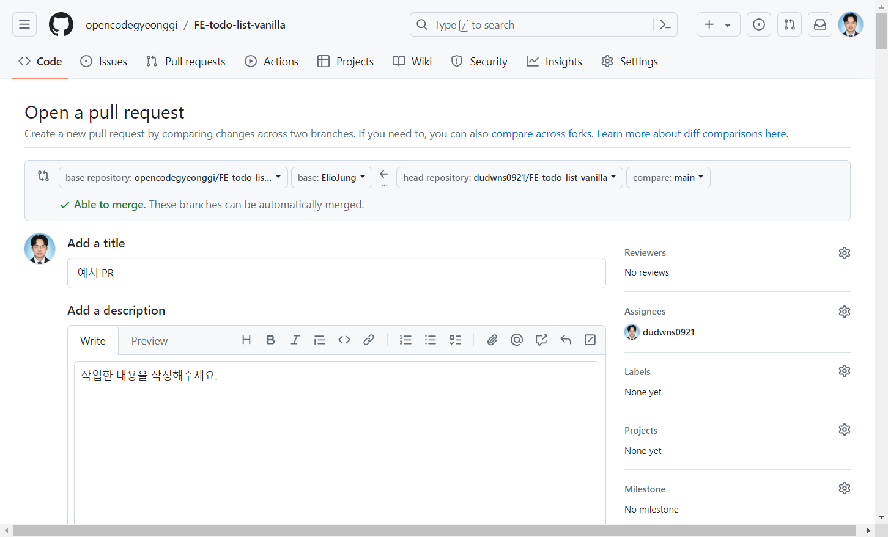
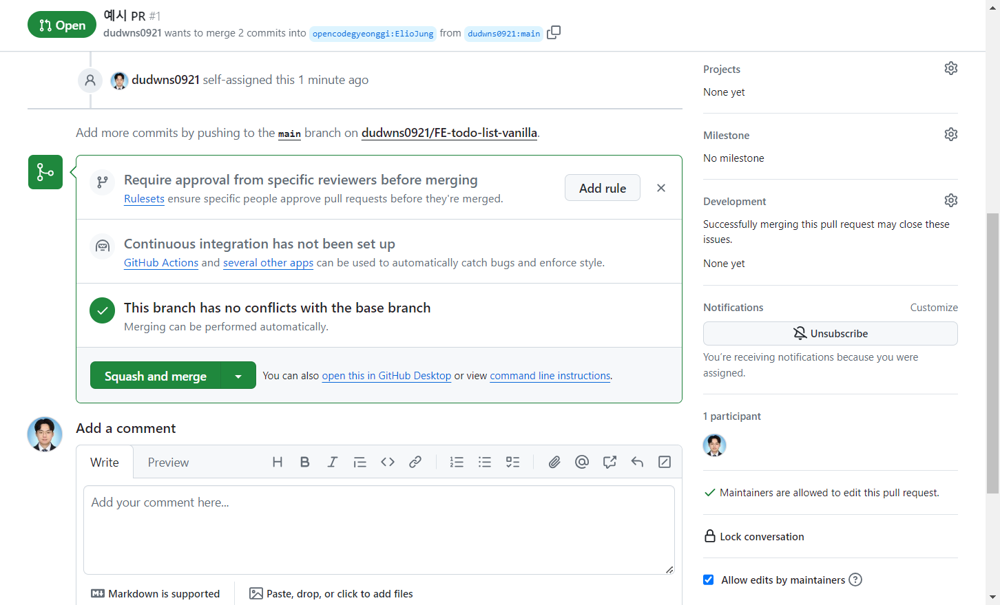

# FE-todo-list-vanilla

## 과제 진행 방법

### 본인 이름의 브랜치를 생성한다.



### 본 레포지토리를 fork한다.



### 포크한 레포지토리를 로컬로 클론한다.



```
git clone [clone할 Web URL]
```

### 업스트림 저장소를 터미널을 통해 등록한다.

```
git remote add -t ElioJung upstream https://github.com/opencodegyeonggi/FE-todo-list-vanilla.git
git remote add -t [업스트림 브랜치명] upstream [업스트림 주소]
```

### 등록 후 upstream이 등록되었는지 확인한다.

```
git remote -v
```



### 과제 완료 후 기존 README 파일의 내용을 지우고 기능 시연 내용을 업데이트 한다.

예시는 아래 링크 참조

https://github.com/opencodegyeonggi/FE-todo-list-vanilla/tree/ElioJung

### 이후 커밋 및 푸시를 진행한다.



### 작업이 끝나면 업스트림의 본인 브랜치로 PR 을 생성한다.

### (origin 작업한 브랜치 -> 업스트림 본인 아이디 브랜치)



### Assignees 는 본인, Reviewers는 dudwns0921과 다른 한 명을 지정한다.



### 코드 리뷰가 끝나면 merge한다.


